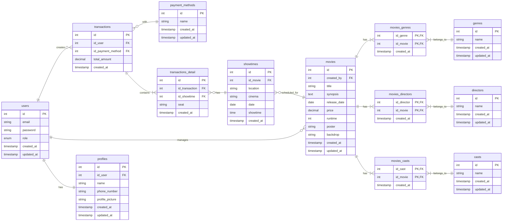

# Tickitz Backend App with NodeJS

This project was made by Muhammad Davinda Rinaldy in Kodacademy Training Program. This project uses NodeJS with ExpressJS framework to make backend app for tickitz, uses PostgreSQL for the SQL database and uses Redis for the NoSQL database.

Endpoint included in this project:
1. Auth (Register, Login, Forgot Password, Reset Password, Logout)
2. User (Update Profile/Credentials, Get Profile Data)
3. Movies (Get Movies, Get Detail Movie, Get Upcoming Movie, Get Genres, Get Directors, Get Casts, Add Genre, Add Director, Add Cast, Add Movie, Update Movie, Delete Movie) 
4. Transactions (Add Transaction, Get Transaction History, Get Reserved Seats, Get Payment Method, Add Payment Method, Get Sales Data)

## Endpoints Overview
| Method    | Endpoint | Description | Auth | Role |
| -------- | -------  | ------- | ------ | ------ |
| POST  | /auth/register | Create new user | No | - |
| POST  | /auth/login | Login | No | - |
| POST  | /auth/pass | Request to change password | No | - |
| PATCH  | /auth/pass | Change password with OTP | No | - |
| POST  | /auth/logout | Logout | Yes | User/Admin |
| PATCH  | /profile | Update user's data | Yes | User |
| GET  | /profile | Get user's data | Yes | User |
| GET  | /movies | Get all movies data | No | - |
| GET  | /movies/:id | Get one movie data | No | - |
| GET  | /movies/upcoming | Get all upcoming movie | No | - |
| GET  | /admin/genres | Get all genres | Yes | Admin |
| GET  | /admin/directors | Get all directors | Yes | Admin |
| GET  | /admin/casts | Get all casts | Yes | Admin |
| POST  | /admin/genres | Add new genre | Yes | Admin |
| POST  | /admin/directors | Add new director | Yes | Admin |
| POST  | /admin/casts | Add new cast | Yes | Admin |
| POST  | /admin/movies | Add new movie | Yes | Admin |
| PATCH  | /admin/movies/:id | Update movie's data | Yes | Admin |
| DELETE  | /admin/movies/:id | Delete movie | Yes | Admin |
| POST  | /admin/payment-methods | Add new payment method | Yes | Admin |
| GET  | /transactions/payment-methods | Get all payment methods | Yes | User/Admin |
| POST  | /transactions | Add new transactions | Yes | User |
| GET  | /transactions | Retrieve all transactions history per user | Yes | User |
| GET  | /transactions/seats | Retrieve all reserved seats for specific showtime | Yes | User |
| GET  | /admin/sales | Get sales data per movie | Yes | Admin |

## How to Run this Project

1. Create a new empty directory for the project and navigate into it
2. Clone this project
```
git clone https://github.com/mdavindarinaldy/fgo24-node-weeklytask.git .
```
3. Install dependencies
```
npm install
``` 
4. Run the project
```
npm run dev
```

## Database Schema

### SQL DB: Entity Relationship Diagram



### NoSQL DB (Redis):
- **otp**: Stores temporary OTP codes using the user's ID as the key, used for password reset verification.
- **blacklist_tokens**: Stores logged-out JWT tokens to prevent reuse before they expire.
- **caching**: Used to temporarily store frequently accessed data to improve read performance.

## Dependencies
This project is built using Node.js, so make sure to have **Node** installed on your machine. It uses **Express.js** as the main web framework, and includes the following dependencies:

### Runtime Dependencies
1. **express**: Web framework for building the API.
2. **sequelize**: Promise-based ORM for PostgreSQL.
3. **pg**: PostgreSQL client for Node.js.
4. **dotenv**: Loads environment variables from .env file.
5. **argon2**: Secure password hashing algorithm.
6. **jsonwebtoken**: For generating and verifying JWT tokens.
7. **ioredis**: Redis client used for OTP and token management.
8. **multer**: Middleware for handling file uploads.
9. **nodemailer**: For sending emails (e.g. OTP or notifications).
10. **express-validator**: For validating and sanitizing user input.
11. **morgan**: HTTP request logger middleware.
12. **uuid**: For generating unique IDs.

### Development Dependencies
1. **eslint**: For code linting and style checking.
2. **sequelize-cli**: CLI for managing Sequelize migrations and models.

## Basic Information
This project is part of training in Kodacademy Bootcamp Batch 24 made by Muhammad Davinda Rinaldy